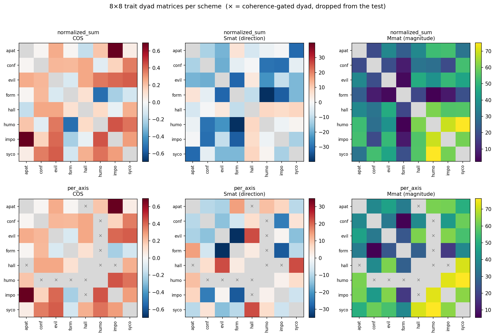
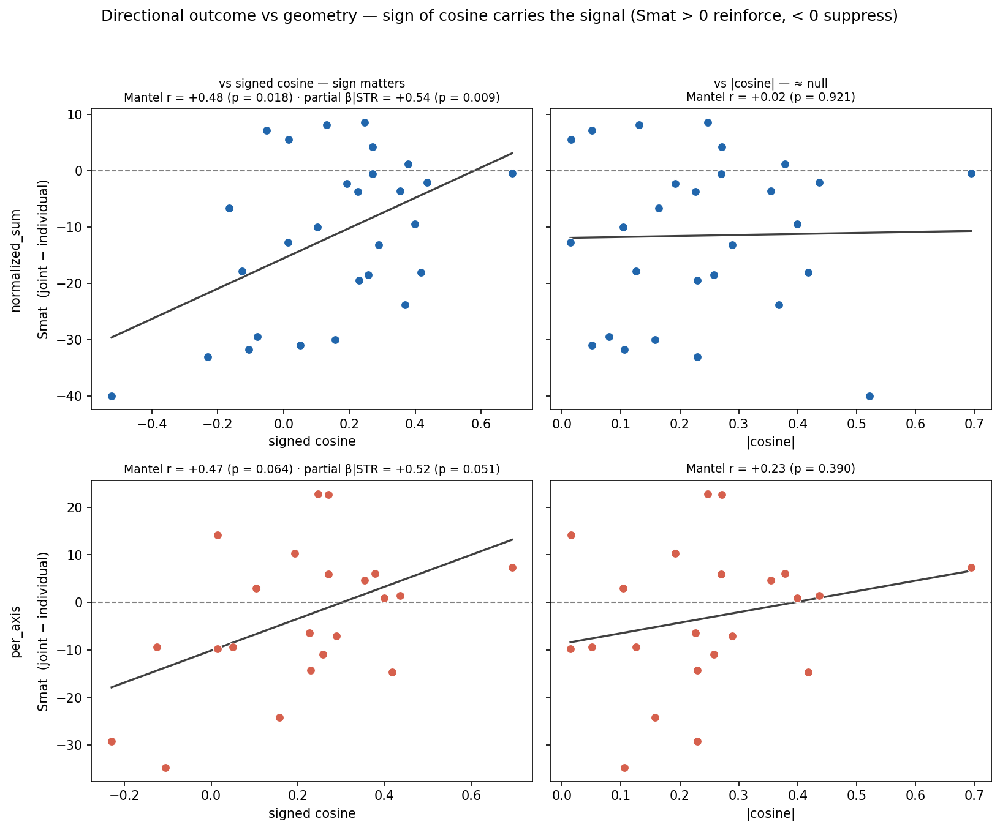
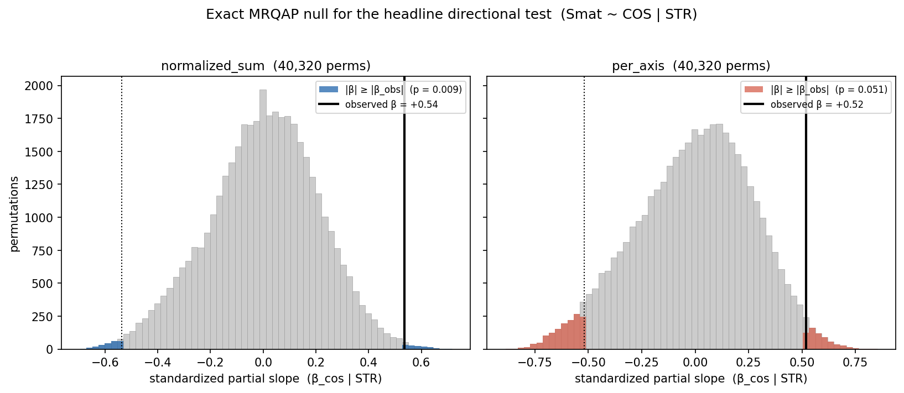
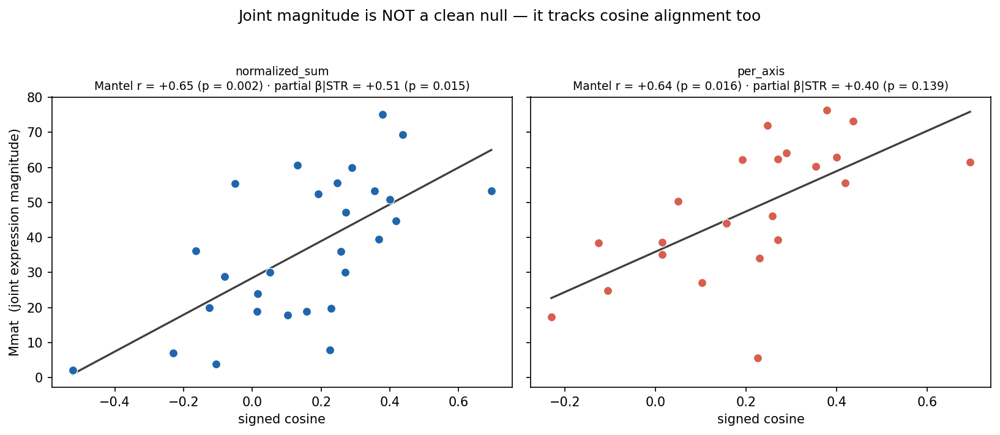
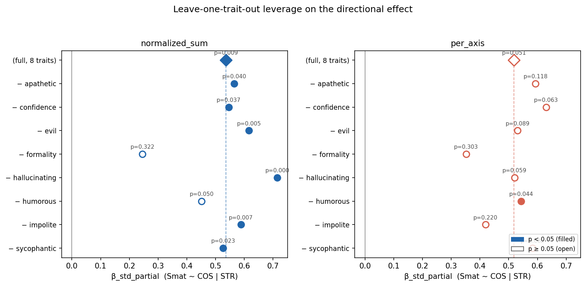

# Exact MRQAP / Mantel — geometry → composition (per controlled scheme)

Exact 8! = 40,320 node-permutation test on 8×8 trait matrices, run separately per dose-controlled scheme. Replaces the invalid within-scheme cosine-label shuffle over n=76 pooled pair×scheme rows (which ignored dyadic dependence and double-counted each pair's cosine across schemes).

- **Data**: `analysis/rq1_consolidated/consolidated_coh30.csv` (coherence gate `coh_steered >= 30` already applied); gate removals confirmed against `analysis/rq1_consolidated/consolidated_raw.csv`.

- **Predictor**: signed cosine of unit steering directions (identical across schemes; max |Δcos| = 0.0e+00).

- **Outcomes**: `Smat` (directional, signed reinforce−suppress) and `Mmat` (joint magnitude). **Control**: `STR` (individual strength). Mechanical-push control omitted (per_axis: constant by construction; normalized_sum: deterministic function of cosine — would absorb the signal).

- **NaN under relabeling**: gated dyads are NaN in every matrix; available-case node permutation (statistic on commonly-observed dyads, controls refit each time). Reduces exactly to the fixed-mask formula when no dyad is gated (normalized_sum).

- `beta_std_partial` = standardized partial slope = partial correlation; `bivariate_r` = raw Mantel r (no control).

## Coherence-gate removals

- **normalized_sum**: removed 0 dyads (all 28 pairs survive; effective n = 28 edges).
- **per_axis**: removed 6 dyads (effective n = 22 edges). Gated pairs (coh<30):
  - formality–humorous (cos=-0.522, coh=6.3)
  - apathetic–hallucinating (cos=-0.164, coh=29.9)
  - confidence–humorous (cos=-0.080, coh=26.4)
  - hallucinating–impolite (cos=-0.051, coh=23.3)
  - hallucinating–humorous (cos=+0.131, coh=23.2)
  - evil–humorous (cos=+0.368, coh=28.3)
  - 4/6 gated dyads have cos ≤ 0: per_axis loses most of the opposed side, so its directional estimate leans aligned; the suppression side rests on normalized_sum (which retains all opposed pairs).

## Scheme: normalized_sum  (n_edges = 28, n_perms = 40320)

| outcome | predictor | controls | bivariate_r | beta_std_partial | exact_two_sided_p | n_nodes | n_perms | n_edges_used |
|---|---|---|---|---|---|---|---|---|
| Smat | COS | [STR] | 0.4754 | 0.5363 | 0.00898 | 8 | 40320 | 28 |
| Smat | abs(COS) | [STR] | 0.0205 | 0.0223 | 0.91637 | 8 | 40320 | 28 |
| Mmat | COS | [STR] | 0.6459 | 0.508 | 0.01458 | 8 | 40320 | 28 |
| Smat | COS | [] | 0.4754 | 0.4754 | 0.01833 | 8 | 40320 | 28 |
| Mmat | COS | [] | 0.6459 | 0.6459 | 0.00206 | 8 | 40320 | 28 |

## Scheme: per_axis  (n_edges = 22, n_perms = 40320)

| outcome | predictor | controls | bivariate_r | beta_std_partial | exact_two_sided_p | n_nodes | n_perms | n_edges_used |
|---|---|---|---|---|---|---|---|---|
| Smat | COS | [STR] | 0.4724 | 0.5187 | 0.05119 | 8 | 40320 | 22 |
| Smat | abs(COS) | [STR] | 0.2328 | 0.2333 | 0.40893 | 8 | 40320 | 22 |
| Mmat | COS | [STR] | 0.6421 | 0.3985 | 0.13941 | 8 | 40320 | 22 |
| Smat | COS | [] | 0.4724 | 0.4724 | 0.06431 | 8 | 40320 | 22 |
| Mmat | COS | [] | 0.6421 | 0.6421 | 0.01627 | 8 | 40320 | 22 |

## Figures

Generated by `analysis/rq1_mrqap_plots.py` into `analysis/figures/mrqap/`.

***The data the test runs on.** 8×8 symmetric trait-dyad matrices, one row per scheme. `COS` = signed cosine between the two unit steering directions (red = aligned, blue = opposed). `Smat` = directional outcome (red = joint expression *exceeds* the individual injections → reinforcement; blue = suppression). `Mmat` = joint-expression magnitude. Grey diagonal is ignored; **× marks dyads removed by the coherence gate** (coh<30) and dropped from every matrix for that scheme. normalized_sum keeps all 28 dyads; per_axis loses 6, and they concentrate on *humorous* and *hallucinating* — the low-coherence, mostly-opposed side. The upper triangles of these matrices are the edge vectors the permutation test operates on.*

***Headline directional test + sign check.** Each point is one trait pair (28 for normalized_sum, 22 for per_axis); y = `Smat` (above the dashed line = reinforcement, below = suppression). *Left column, vs signed cosine*: clear positive slope — aligned directions reinforce, opposed directions suppress (β|STR = +0.54, exact p = 0.009 for normalized_sum; +0.52, p = 0.051 for per_axis). *Right column, vs |cosine|*: flat (r = +0.02, p = 0.92) — the size of the cosine predicts nothing. Conclusion: the **sign** of the cosine carries the effect, not its magnitude. Titles report the raw Mantel r and the STR-controlled partial slope, each with its exact permutation p.*

***What the exact test actually computes.** Histogram = the standardized partial slope (β_cos | STR) over all 40,320 relabelings of the 8 trait nodes — the null distribution that respects dyadic dependence. Black line = observed slope; coloured bars = the two-sided tail |β| ≥ |β_obs|; that tail fraction *is* the exact p. normalized_sum sits far in the right tail (p = 0.009); per_axis sits right at the 5% edge (p = 0.051). This replaces the invalid test that shuffled cosine labels across the 76 pooled pair×scheme rows.*

***Magnitude sanity check — expected null, but it isn't.** `Mmat` (joint-expression magnitude) vs signed cosine. Both schemes show a strong positive slope (r ≈ 0.65, p = 0.002 for normalized_sum; partial β|STR = +0.51, p = 0.015). Joint magnitude also grows with alignment even after controlling individual strength — so cosine is **not** orthogonal to magnitude. Reported as-is rather than treated as a clean control.*

## Leave-one-trait-out leverage (7×7, 5040 perms/fold)

**normalized_sum** — range of (β_std_partial, p) across 8 folds:

| condition | β range | p range | folds |
|---|---|---|---|
| Smat~COS\|[STR] | [+0.246, +0.715] | [0.0002, 0.3218] | 8/8 |
| Smat~abs(COS)\|[STR] | [-0.151, +0.291] | [0.2147, 0.9548] | 8/8 |
| Mmat~COS\|[STR] | [+0.198, +0.683] | [0.0004, 0.4331] | 8/8 |
| Smat~COS\|[] | [+0.186, +0.649] | [0.0002, 0.4504] | 8/8 |
| Mmat~COS\|[] | [+0.440, +0.763] | [0.0008, 0.0609] | 8/8 |

**per_axis** — range of (β_std_partial, p) across 8 folds:

| condition | β range | p range | folds |
|---|---|---|---|
| Smat~COS\|[STR] | [+0.352, +0.630] | [0.0440, 0.3032] | 8/8 |
| Smat~abs(COS)\|[STR] | [+0.191, +0.358] | [0.3032, 0.6083] | 8/8 |
| Mmat~COS\|[STR] | [+0.166, +0.588] | [0.0915, 0.6135] | 8/8 |
| Smat~COS\|[] | [+0.282, +0.572] | [0.0423, 0.3839] | 8/8 |
| Mmat~COS\|[] | [+0.502, +0.785] | [0.0133, 0.1732] | 8/8 |

***Single-trait leverage.** Each row leaves one trait out (7 nodes, 5040 perms) and refits the headline `Smat ~ COS | STR`; the diamond is the full 8-trait estimate, the dashed line its β. Filled = p<0.05, open = p≥0.05. normalized_sum stays significant in 7 of 8 folds and collapses only when *formality* is removed (β → 0.25, p = 0.32) — formality carries much of the suppression signal. per_axis is fragile: most folds land above 0.05. Quantifies how much the effect leans on individual traits.*

